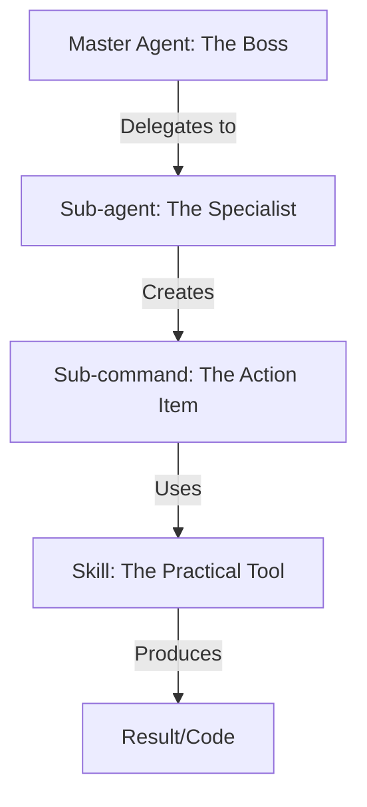

# Agentic Library

## About

This folder is a collection of my Agentic Assets that I am using when doing Agentic Coding, or as I call it _kompis-kodning_.

Some manifests I've written myself, and others are things I found on the web, see resources below. Good practice is to keep your global assets
technology-agnostic if

## Agent vs. Skill in Agentic Coding

In the context of **agentic coding**, the relationship between an agent and a skill is best understood as the relationship between a **worker** and their **toolbox**.

---

### 1. The Agent (The "Brain")

An agent is an autonomous entity powered by a Large Language Model (LLM). It is the "thinking" part of the system that understands natural language, sets goals, and makes decisions.

- **Reasoning:** It can analyze a bug report and decide which files to look at.
- **Planning:** It breaks down a large task (e.g., "Build a login page") into smaller, sequential steps.
- **Self-Correction:** If a command fails, the agent looks at the error, adjusts its strategy, and tries again.
- **Memory:** It keeps track of what it has already done and what remains to be done.

---

### 2. The Skill (The "Tool")

A skill (often referred to as a **Tool** or **Function**) is a specific, predefined capability that the agent can invoke. It is usually a deterministic piece of code.

- **Execution:** It performs a single, specialized task (e.g., "Read a file," "Run a terminal command," or "Query a database").
- **Structure:** It has a defined input (parameters) and a defined output.
- **Boundaries:** A skill cannot "think" or decide when to run; it simply waits for the agent to call it.
- **Interface:** It provides a way for the LLM to interact with the real world (the file system, the internet, or a compiler).

---

### Comparison Table

| Feature            | **Agent** (The Brain)          | **Skill** (The Tool)                  |
| :----------------- | :----------------------------- | :------------------------------------ |
| **Nature**         | Probabilistic (LLM-driven)     | Deterministic (Code-driven)           |
| **Responsibility** | High-level strategy and logic. | Low-level execution of a task.        |
| **Example**        | A "Senior Dev" agent.          | A function called `execute_pytest()`. |
| **Analogy**        | The Architect.                 | The Blueprints and Hammer.            |

---

### Summary

- **The Agent** is the **Decider**. It understands the _why_ and the _what_.
- **The Skill** is the **Doer**. It understands the _how_ for a specific, narrow action.

In a modern coding workflow (like GitHub Copilot Workspace or OpenDevin), the **Agent** reads your prompt, creates a plan, and then uses its **Skills** (like `ls`, `grep`, `write_file`, and `npm test`) to actually modify your codebase and verify the results.

## sub-agents and sub-commands

When a task gets too complex for a single Agent and its Skills, we introduce **Sub-agents** to delegate the workload.

---

### 1. The Hierarchy: From Brain to Tool

| Concept         | Role                   | Analogy                                                              |
| :-------------- | :--------------------- | :------------------------------------------------------------------- |
| **Agent**       | The CEO / Architect    | The Brain that owns the ultimate goal.                               |
| **Sub-agent**   | The Department Manager | A specialized "mini-brain" delegated to a specific part of the goal. |
| **Sub-command** | The To-Do List Item    | A single, logical step in the plan (e.g., "Check the logs").         |
| **Skill**       | The Power Tool         | The actual code/function that interacts with the world.              |

---

### 2. What is a Sub-agent?

A **Sub-agent** is an agent spawned by a "Master" or "Orchestrator" agent to handle a specific domain. While a regular Agent might try to do everything, a Sub-agent is specialized.

- **Delegation:** If the Master Agent realizes the task requires deep CSS knowledge and also complex Database optimization, it might spawn one **UI Sub-agent** and one **DB Sub-agent**.
- **Encapsulation:** The Sub-agent has its own "thought process." It reports back to the Master Agent with a result, keeping the Master Agent's "head" clear of tiny details.
- **Parallelism:** In advanced systems, multiple Sub-agents can work on different **Sub-commands** at the same time.

> **Scenario:** > \* **Master Agent Goal:** "Build a weather app."
>
> - **Sub-agent A (Backend):** Tasked with setting up the API and Database.
> - **Sub-agent B (Frontend):** Tasked with creating the UI components.
> - **Both Sub-agents** use their own **Skills** (e.g., `npm install`, `sql_query`) to complete their specific **Sub-commands**.

---

### 3. The Complete Workflow Summary

1. **The Agent (The Boss):** Receives the prompt "Build a secure login system." It realizes this is a big job.
2. **The Sub-agent (The Specialist):** The Boss spawns a "Security Sub-agent" specifically to handle encryption and password hashing.
3. **The Sub-command (The Step):** The Security Sub-agent decides on a plan. Step 1: "Implement Argon2 hashing." This is the sub-command.
4. **The Skill (The Instrument):** To execute that step, the Sub-agent calls a **Skill**—a Python function called `install_package("argon2-cffi")`.

---

### Visual Summary

