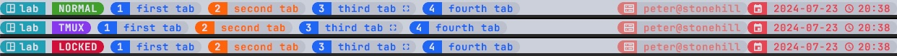
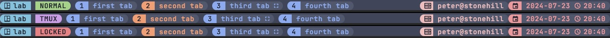
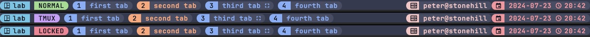
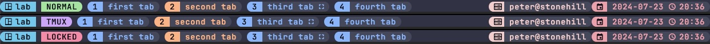
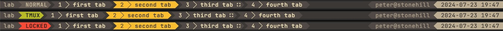
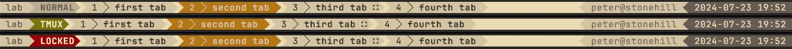

# Templates

 
## Catppuccin

[Catppuccin](https://github.com/catppuccin/catppuccin) is a community-driven pastel theme that aims to be
 the middle ground between low and high contrast themes. It consists of 4 soothing warm flavors with
 26 eye-candy colors each, perfect for coding, designing, and much more!

Here is the template for Catppuccin > [catppuccin.kdl](./catppuccin.kdl)

### Flavours

#### Latte



#### Frappé



#### Macchiato



#### Mocha



## Gruvbox

[Gruvbox](https://github.com/morhetz/gruvbox) is designed as a bright theme with pastel 'retro groove' colors and light/dark mode switching in the way of solarized.

Here is the template for Gruvbox > [gruvbox.kdl](./gruvbox.kdl)

### Flavours

#### Dark Mode



### Ligth Mode



# Usage

## How to use plugins

The best and concise way to use a plugin in Zellij is to declare it as an alias in `config.kdl` and
 then use the alias in your layout file.

**config.kdl**
```kdl
plugins {

    zjstatus location="file:~/.local/share/zellij/plugins/zjstatus.wasm" {
        ... insert theme content here
    }
}
```
and then use the alias `zjstatus` in the layout file
```kdl
layout {
    pane
    pane size=1 borderless=true {
        plugin location="zjstatus"
    }
}
```
# How to use the templates

1. Copy the content of the theme to the body of the zjstatus declaration in your config or layout file, see `config.kdl` above
2. Uncomment the color palette you want to use.


If you want to use borders with`zjstatus` you have to enable it and then change pane size to two in the layout.

**zjstatus config**
```kdl
border_enabled  "false"
```
**layout file**
```kdl
pane size=2 borderless=true {
    plugin location="zjstatus"
}

```

